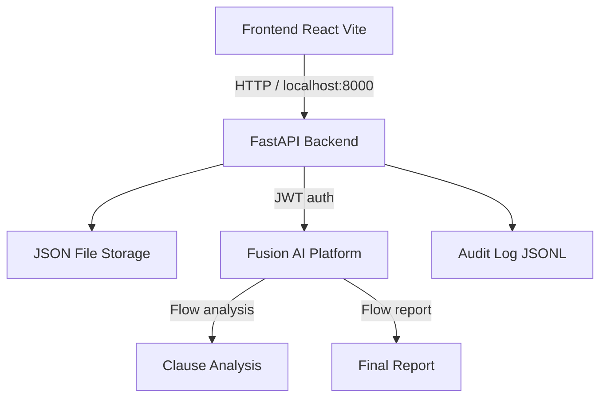

# ClauseGuard

Assistant de pré-lecture contractuelle alimenté par l'IA, avec revue humaine (HITL) et génération de rapport.

## Architecture



## Prérequis

- Python 3.11+
- Node.js 20+
- Windows PowerShell

## Configuration

Créez `backend/.env` à partir de l'exemple :

```powershell
cd backend
copy .env.example .env
```

Exemple de contenu :

```env
FUSION_BASE_URL=https://stg-agentic.abafusion.ai
FUSION_LOGIN_URL=https://stg-login.abafusion.ai
FUSION_USERNAME=votre_username
FUSION_PASSWORD=votre_mot_de_passe
FLOW_ANALYSIS_ID=a07252c9-b063-4b31-9bdf-373725ac7657
FLOW_REPORT_ID=1db72ffe-68c6-4dd2-8f68-1e15f4449b89
FLOW_REPORT_FALLBACK_ID=
SECRET_KEY=change-me-in-production
ACCESS_TOKEN_EXPIRE_MINUTES=30
REFRESH_TOKEN_EXPIRE_MINUTES=10080
ALLOWED_ORIGIN=http://localhost:5173
# ANONYMIZER_NER=off
```

### Couche NER avancée (optionnelle)

L'anonymisation repose par défaut sur des regex et les noms de parties fournis.
Vous pouvez activer une couche GLiNER optionnelle pour détecter automatiquement
les personnes non listées :

```env
ANONYMIZER_NER=on
```

- Premier téléchargement du modèle `urchade/gliner_medium-v2.1` : ~500 Mo.
- Etiquette utilisée : `person` uniquement (pas d'organisation, pas d'adresse).
- Seuil de confiance : 0.5.
- Si le modèle ne se charge pas (OOM, erreur réseau, etc.), le pipeline
  continue sans NER : aucun échec d'upload n'est causé par la couche NER.

Pour la démo, laissez `ANONYMIZER_NER=off` (comportement par défaut) ; la NER
est la "couche avancée" à montrer uniquement s'il reste du temps.

## Backend

```powershell
cd backend
py -3.11 -m venv .venv
.venv\Scripts\Activate.ps1
python -m pip install --upgrade pip
pip install -r requirements.txt
uvicorn main:app --reload --host 127.0.0.1 --port 8000
```

Pour tester avec des réponses Fusion simulées :

```powershell
python run_mock_server.py
```

## Tests backend

```powershell
cd backend
pytest tests/ -v
```

## Frontend

```powershell
cd frontend
npm install
npm run dev
```

L'application est accessible sur `http://localhost:5173`.

## Build frontend

```powershell
cd frontend
npm run build
```

## Déroulement fonctionnel

1. **Charger** : déposez un PDF, DOCX ou TXT. Le texte est anonymisé (emails, téléphones, CIN, RIB, IBAN, ICE, noms des parties) avant envoi à l'IA.
2. **Analyser** : le backend appelle le flow d'analyse Fusion et retourne les clauses auditées.
3. **Revue** : l'utilisateur valide les décisions sur les clauses ORANGE et ROUGE.
4. **Rapport** : génération du rapport final via le flow de rapport Fusion, téléchargeable en JSON.

## Avertissement

ClauseGuard est un assistant de pré-lecture contractuelle. Il ne fournit pas de conseil juridique et ne remplace pas un avocat.
